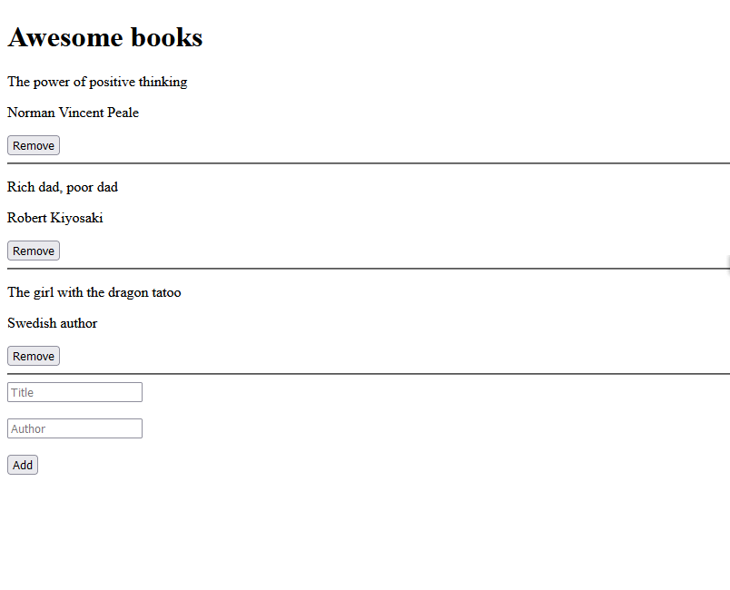

# Project Name

A basic website that allows users to add/remove books from a list.

## Built With

- HTML
- CSS
- JAVASCRIPT

## Live Demo

[Live Demo Link](https://code-panther.github.io/Awesome-Books/)

## Getting Started

To get a local copy up and running follow these simple example steps.

### Prerequisites
There are no prerequisites

### Setup
Just clone the repository to your local machine and you are all set.
`git clone https://github.com/Code-panther/Portfolio.git`

## Authors

👤 **Codepanther**

- GitHub: [@Code-panther](https://github.com/Code-panther)
- Twitter: [@codepantherr](https://twitter.com/codepantherr)
- LinkedIn: [promise-eze](https://linkedin.com/in/promise-eze)

👤 **Nicupop**

- GitHub: [@nicupop729](https://github.com/nicupop729)
- Twitter: [@nicupop729](https://twitter.com/nicupop729)
- LinkedIn: [LinkedIn](https://www.linkedin.com/in/nicolae-pop/)

## 🤝 Contributing

Contributions, issues, and feature requests are welcome!

Feel free to check the [issues page](../../issues/).

## Show your support

Give a ⭐️ if you like this project!

## 📝 License

This project is [MIT](./MIT.md) licensed.
